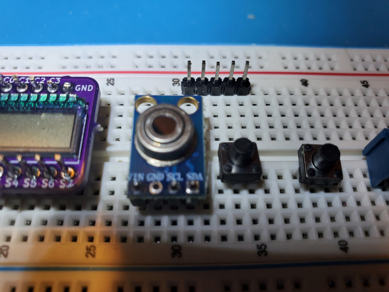

# pic-ir-thermometer

(Under construction.)

Open-source hardware and firmware for a PIC16LF19156-driven IR non-contact thermometer using a Melexis MLX90614 sensor and Lumex LCD-S401M16KR LCD segment display.

This project demonstrates several major functions of a Microchip PIC microcontroller (MCU):
1. using the built-in LCD driver module to directly drive a multiplexed LCD segment display
2. using the I2C/IIC/SMBus interface (MSSP) to communicate with an external temperature sensor
3. using the timer (TMR2, TMR4) and configurable logic cell (CLC) modules to debounce switch inputs in hardware
4. using the timer module (TMR0) to detect timeout of user input
5. using the internal voltage reference (FVR) and analog-to-digital converter (ADC) modules to detect low-battery state with no external components required

The firmware is written in C using the free version of the Microchip MPLAB X IDE and XC8 compiler.
As much code as practical is generated rather than hand-written
by using the Microchip Code Configurator (MCC) plugin-in to MPLAB.

The hardware uses minimal parts.
Reverse battery protection and boost conversion are included,
but could be omitted (especially when breadboarding) by powering from two alkaline cells or a bench supply
instead just one alkaline/NiCd/NiMH AA cell.

A 3D-printable, handheld enclosure design holding a single AA cell is included.
